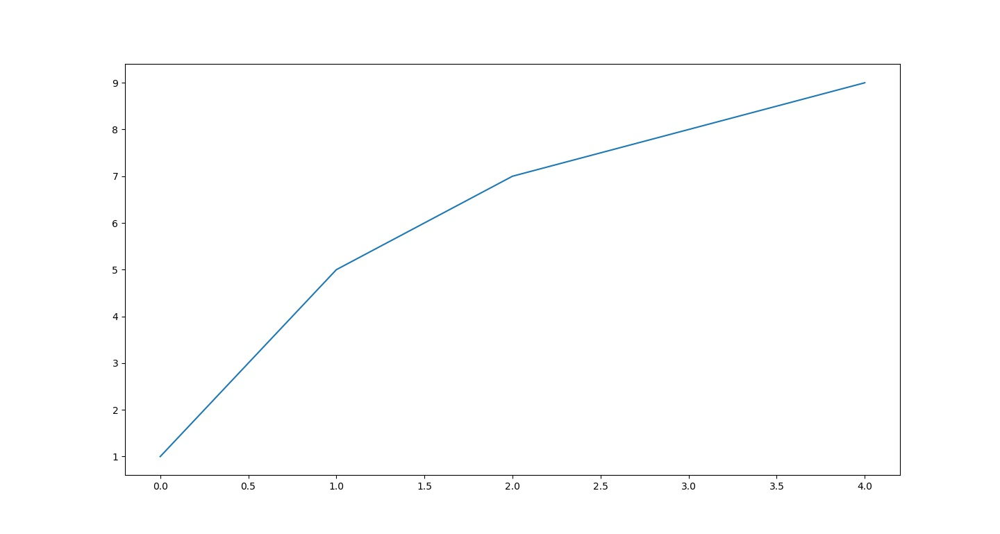
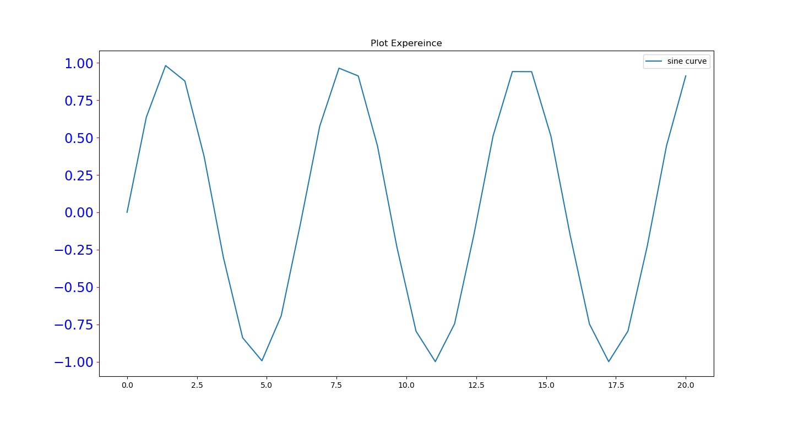
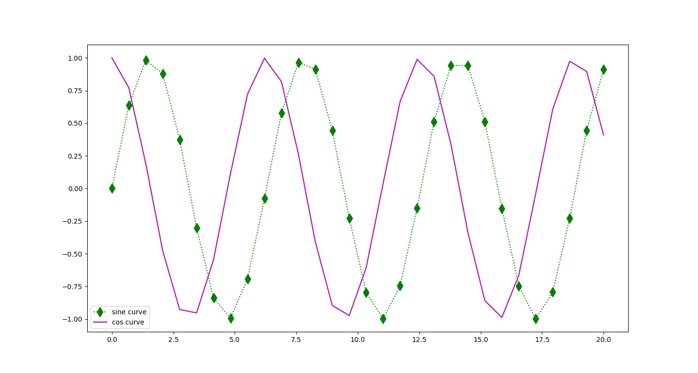
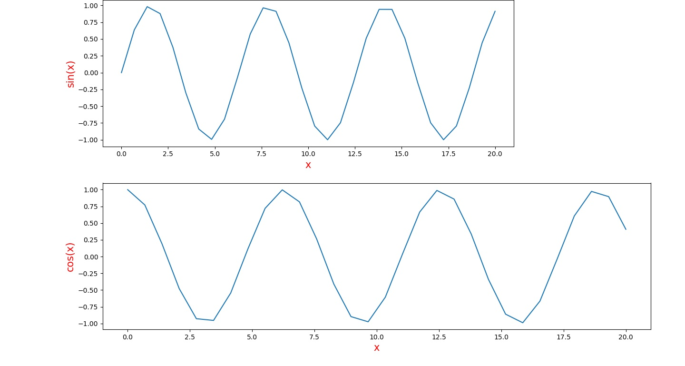
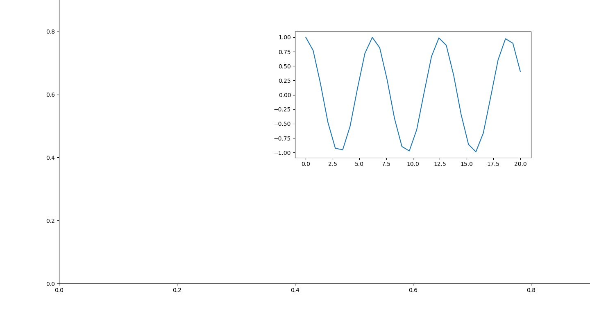
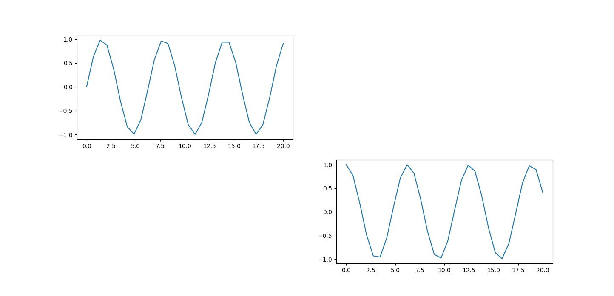
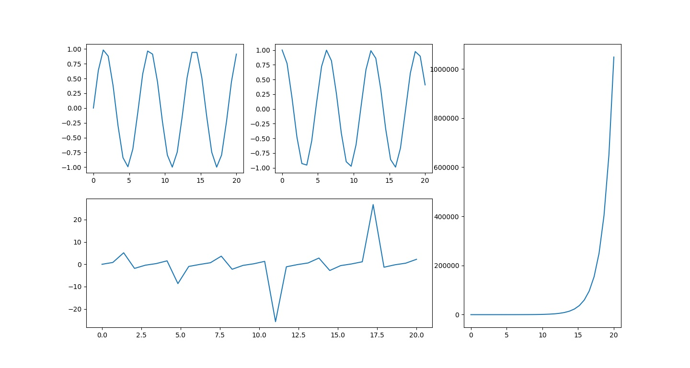

Figure_0 of code: Matplotlib_Basic

Figure_1 of code: Matplotlib_Basic

Figure_2 of code: Matplotlib_Basic

Figure_3 of code: Matplotlib_Basic

Figure_4 of code: Matplotlib_Basic

Figure_5 of code: Matplotlib_Basic

Figure_6 of code: Matplotlib_Basic

Figure_7 of code: Matplotlib_Basic

